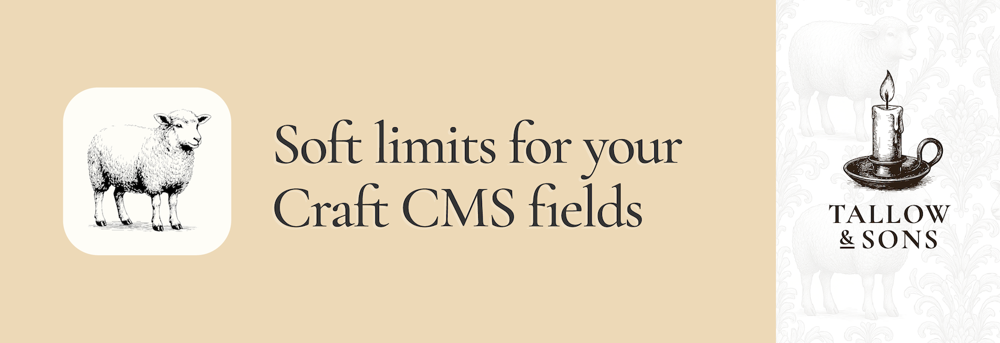

# Soft Limit for Craft CMS

**Improve authorship experience quality** with gentle character limit guidance. Soft Limit provides real-time character counters for text fields, helping content creators stay within recommended limits without blocking their workflow.

## 🔧 Quick Start

### 1. Install Soft Limit

You can install Soft Limit by searching for "Soft Limit" in the Craft Plugin Store, or install manually using composer.

```bash
composer require tallowandsons/craft-soft-limit
```

### 2. Configure Your Fields

Add soft limits to any text field by including a special marker in the field's instructions:

1. Edit any Plain Text, CKEditor, or Redactor field
2. In the field's **Instructions** field, add: `[soft-limit:150]` (replace 150 with your desired character limit)
3. Save the field

### 3. Start Writing 🎉

Your content creators will now see a live character counter that updates as they type, helping them craft content that fits within your guidelines.

## Why Choose Soft Limit?

### Non-Intrusive Guidance
Unlike hard character limits that block saving, Soft Limit provides gentle guidance that helps content creators stay within guidelines without interrupting their workflow.

### Works with multiple field types
Works seamlessly with Plain Text, CKEditor, and Redactor fields.

For rich text fields, Soft Limit intelligently counts characters while handling rich text formatting, providing accurate counts that reflect the actual text content.

## Examples

### Product Descriptions
```
Write a compelling product description that highlights key features. [soft-limit:300]
```

### Meta Descriptions
```
Create an SEO-friendly meta description for this page. [soft-limit:160]
```

### Article Summaries
```
Provide a brief summary of this article for the homepage. [soft-limit:120]
```

## Requirements
This plugin supports
- Craft CMS 5.0.0 or later
- Craft CMS 4.0.0 or later

## License

This plugin requires a commercial license purchasable through the Craft Plugin Store.

## Credits

Made with care and attention by [Tallow &amp; Sons](https://github.com/tallowandsons)
